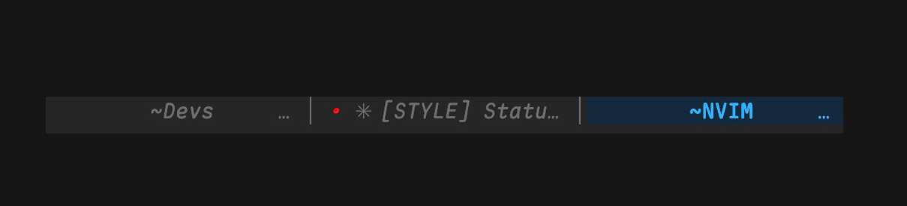
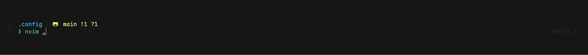
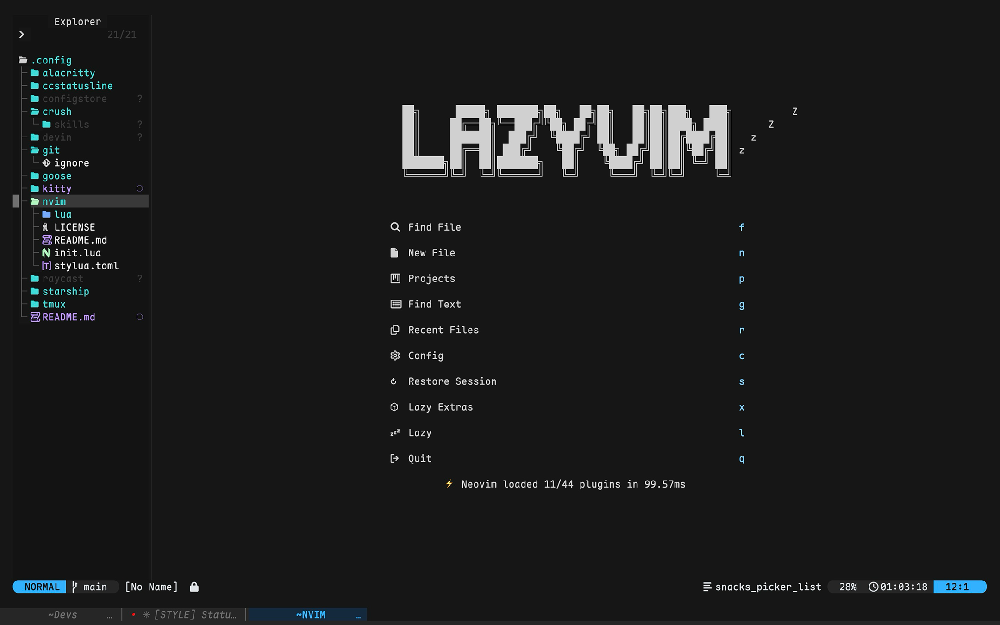
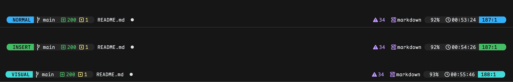
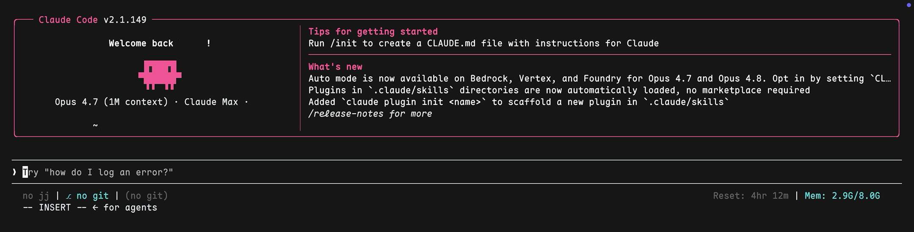

<div align="center">

<pre align="center">
─────────────────────────────────────
             ~/.dotfiles             
─────────────────────────────────────
</pre>

[Oxocarbon]-tuned terminal stack.
**kitty** · **zsh / p10k** · **neovim** · **claude code** · **goose**

<br/>

</div>

---

## Stack

| Layer    | Tool                                       | Notes                                            |
| -------- | ------------------------------------------ | ------------------------------------------------ |
| Terminal | [kitty]                                    | `separator` tab bar, Oxocarbon palette           |
| Shell    | [zsh] + [oh-my-zsh] + [powerlevel10k]      | Lean + Frame multiline prompt                    |
| Editor   | [Neovim] + [LazyVim]                       | Lualine _bubbles_ statusline with live HMS clock |
| AI CLI   | [Claude Code] + [ccstatusline] + [tweakcc] | `dark-ansi` theme reads kitty palette            |
| AI CLI   | [Goose]                                    | Custom skills bundle                             |
| Font     | Maple Mono NF                              | Nerd Font patched, supports PUA glyphs           |

---

## Palette — Oxocarbon Dark

|                                                   | Hex       | Role                                 |
| ------------------------------------------------- | --------- | ------------------------------------ |
|  | `#161616` | Background                           |
|  | `#262626` | Chrome — p10k frame, kitty tab strip |
|  | `#DDE1E6` | Foreground                           |
|  | `#6F6F6F` | Foreground dim                       |
|  | `#33B1FF` | Blue — normal mode, active accent    |
|  | `#42BE65` | Green — insert, success              |
|  | `#3DDBD9` | Cyan — visual                        |
|  | `#FF7EB6` | Magenta — replace                    |
|  | `#FFE97B` | Yellow — command, warning            |
|  | `#EE5396` | Red — error, removed                 |

All four tools (kitty, p10k, nvim, Claude Code) reach for the same ANSI palette indices, so changing one swatch propagates everywhere.

---

## kitty

Tab bar in `separator` style. Titles centered inside an 18-column slot, separated by a thin `│` rule. Active tab tinted dark blue (`#15293D`, 15 % mix of `#33B1FF` into bg); inactive tab in `#262626` so it blends with the chrome strip.



```
kitty/
├── kitty.conf          tab bar + window + keybindings
├── colors.conf         Oxocarbon palette
├── paste_image.sh      cmd+shift+i → paste clipboard image
└── themes/             extra colorschemes (gruvbox, eldritch, …)
```

---

## zsh + powerlevel10k

Lean + Frame prompt, two lines, corner-framed. Directory truncated to the last segment. Right side carries exit status, command duration, and the clock.



> Lives in `$HOME`, not in this repo. Symlink or source from here.

---

## neovim

LazyVim base; a single custom plugin file overrides lualine into a _bubbles_ layout that mirrors the kitty active tab pill.


<br/>


- Mode pill recolors per mode — blue / green / cyan / magenta / yellow.
- Branch + diff + diagnostics + filetype + progress + ticking HMS clock + cursor location.
- Clock ticks every second via `vim.uv.new_timer` + `redrawstatus`.

```
nvim/
├── init.lua
├── lazy-lock.json
├── lazyvim.json
├── lua/
│   ├── config/         LazyVim overrides
│   └── plugins/
│       ├── lualine.lua       bubbles, Oxocarbon-tuned
│       ├── colorscheme.lua
│       └── …
└── .prettierrc.json
```

---

## claude code

`dark-ansi` theme pulls every color from the terminal's ANSI palette, so Claude Code automatically inherits Oxocarbon from kitty. `ccstatusline` drives the per-session statusline (jj-root-dir · git-branch · git-changes · free-memory).



Files:

- `~/.claude/settings.json` — `theme: dark-ansi`, statusline command
- `ccstatusline/settings.json` — widget layout
- `~/.tweakcc/` — backup binary + JS patches (used to tune diff colors)

A pre-tweakcc snapshot of the Claude binary lives at `~/.claude-tweakcc-backup/` (see `RESTORE.md` inside).

---

<div align="center">

<pre align="center">─────────────────────────────────────</pre>

Built around Oxocarbon. Tuned by hand.

<pre align="center">─────────────────────────────────────</pre>

</div>

[Oxocarbon]: https://github.com/nyoom-engineering/oxocarbon.nvim
[kitty]: https://sw.kovidgoyal.net/kitty/
[zsh]: https://www.zsh.org/
[oh-my-zsh]: https://ohmyz.sh/
[powerlevel10k]: https://github.com/romkatv/powerlevel10k
[Neovim]: https://neovim.io/
[LazyVim]: https://www.lazyvim.org/
[Claude Code]: https://docs.anthropic.com/en/docs/claude-code
[ccstatusline]: https://github.com/sirmalloc/ccstatusline
[tweakcc]: https://github.com/Piebald-AI/tweakcc
[Goose]: https://github.com/block/goose
